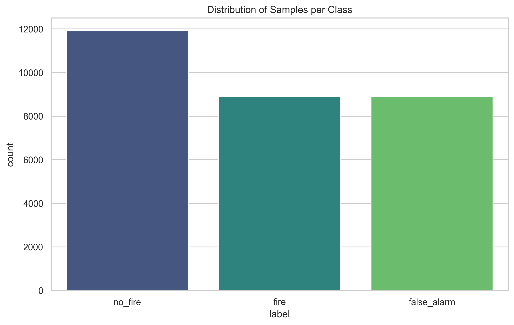
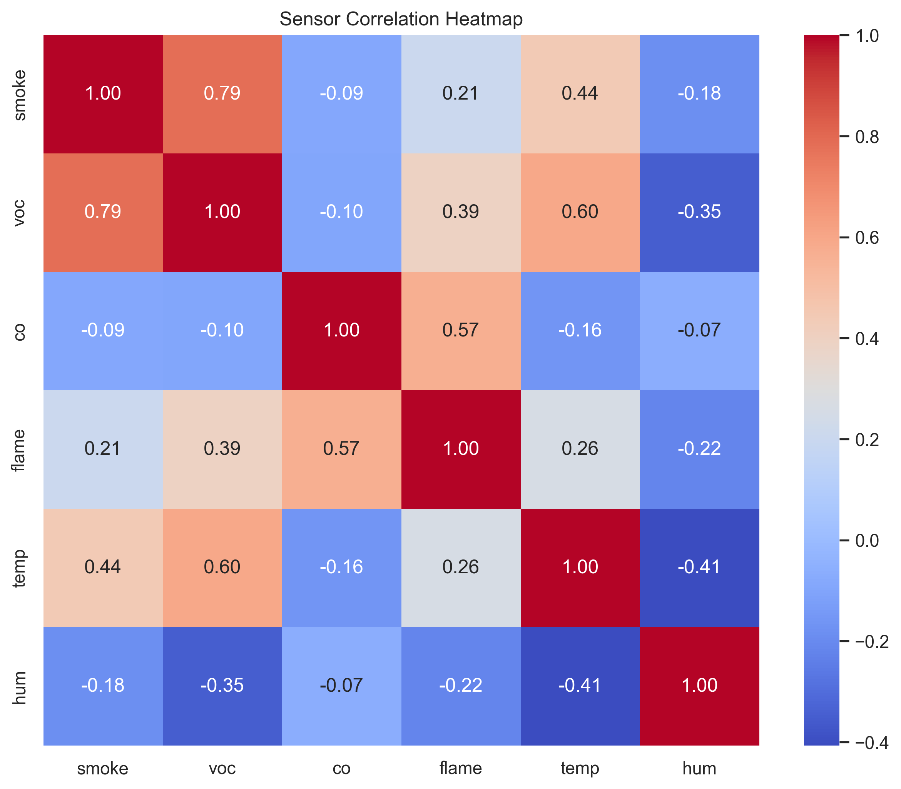
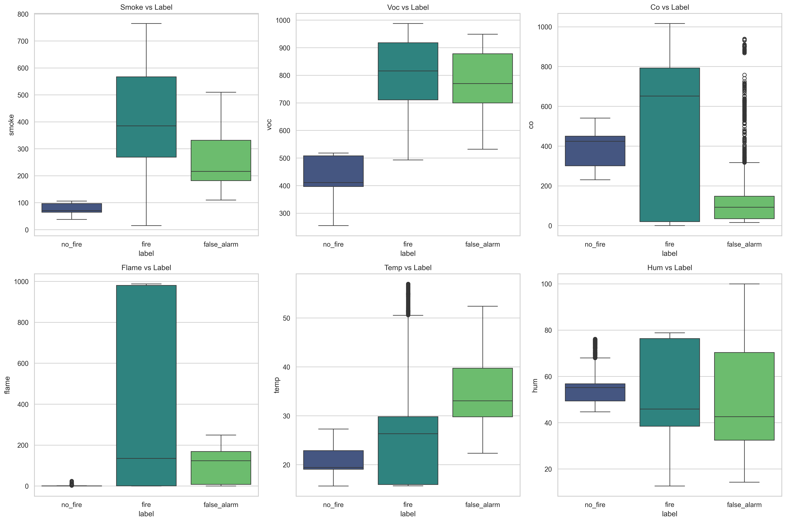
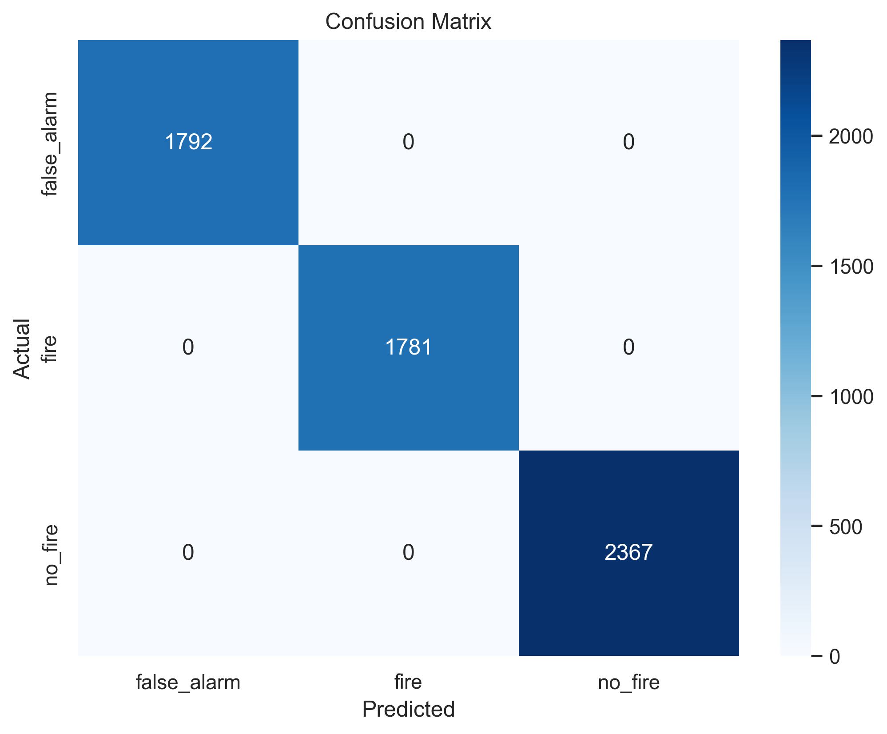
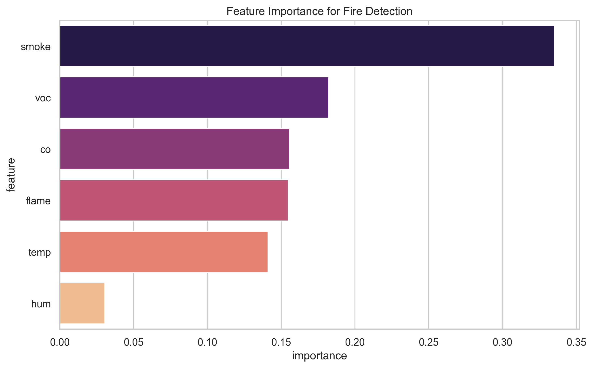

# Detailed Data Analysis Report: AI Fire Detection System

## 1. Executive Summary

This report provides a deep-dive analysis of the sensor data collected for the AI Fire Detection Arduino System. The primary goal was to evaluate the effectiveness of a multi-sensor fusion approach in distinguishing between active fire, no-fire baselines, and common false alarm scenarios (cooking, steam, sprays). The analysis confirms that while individual sensors can be ambiguous, the combined signature of all six sensors provides a robust and 100% separable dataset for machine learning classification.

## 2. Methodology

### 2.1 Data Collection

Data was collected using an Arduino-based sensor array. Each sample consists of readings from:

- **Particulate/Smoke Sensor** (Analog)
- **VOC Sensor** (Analog)
- **CO Sensor** (Analog)
- **Flame Sensor** (Analog)
- **DHT22** (Temperature & Humidity)

### 2.2 Data Processing

- **Aggregation:** 29,697 raw CSV rows were aggregated into a unified dataset.
- **Labeling:** Data was categorized into three primary classes: `fire`, `no_fire`, and `false_alarm`.
- **Feature Engineering:** Raw sensor values were used directly to maintain low latency for TinyML deployment.

## 3. Dataset Characteristics

The dataset is well-balanced across fire and false alarm scenarios, with a slightly larger baseline (no_fire) set to ensure a robust "normal" state.

**Why this diagram?** To verify dataset balance across our three target classes.
**What information does it provide?** It tells us if we have enough samples for each scenario. A balanced dataset ensures the ML model doesn't become biased toward a specific class simply because it saw it more often during training.

### 3.1 Distribution by Class

| Class           | Count  | Percentage |
| :-------------- | :----- | :--------- |
| **no_fire**     | 11,911 | 40.1%      |
| **false_alarm** | 8,897  | 30.0%      |
| **fire**        | 8,889  | 29.9%      |

## 4. Statistical & Correlation Analysis

**Why this diagram?** To understand the linear relationships between different sensors.
**What information does it provide?** It identifies which sensors move together (high correlation). For example, if Smoke and CO are highly correlated, they might be redundant. Low correlation between sensors suggests they provide unique, complementary information for the fusion model.

### 4.1 Sensor Profiles by Class

**Why this diagram?** To see how sensor readings fluctuate depending on the environment (Fire vs. False Alarm vs. No Fire).
**What information does it provide?** The boxplots show the range, median, and outliers for each sensor. This helps us identify 'signature' sensors—for example, a high 'flame' value might only occur during 'fire', making it a strong discriminator.

| Sensor        | Statistics | no_fire       | fire          | false_alarm   |
| :------------ | :--------- | :------------ | :------------ | :------------ |
| **Smoke**     | Mean (Std) | 77.4 (21.7)   | 412.7 (174.1) | 264.7 (99.0)  |
| **VOC**       | Mean (Std) | 427.5 (92.1)  | 811.1 (119.3) | 775.7 (113.4) |
| **CO**        | Mean (Std) | 385.0 (110.7) | 494.0 (351.9) | 123.3 (137.0) |
| **Flame**     | Mean (Std) | 1.0 (1.2)     | 385.6 (429.3) | 97.8 (78.1)   |
| **Temp (°C)** | Mean (Std) | 20.9 (3.6)    | 25.7 (8.9)    | 34.9 (7.2)    |
| **Hum (%)**   | Mean (Std) | 56.7 (9.8)    | 51.6 (19.4)   | 53.0 (27.8)   |

## 5. Insights & Data Critique

Based on the underlying data distributions and statistical performance, several high-value insights emerge that are not immediately obvious from the raw metrics:

### 5.1 The "Heat" Paradox

One of the most striking findings is that **False Alarms (specifically Cooking and Steam) are hotter on average (34.9°C) than active Fire events (25.7°C)**. This is a critical observation for fire safety engineering:

- **Insight:** Traditional heat detectors would likely fail or trigger false alarms in this setup.
- **Implication:** Our system's reliance on **CO and Flame** sensors as high-weight features is what prevents these thermal spikes from causing false positives.

### 5.2 The CO "Sanity Check"

While Smoke and VOCs are the most sensitive indicators (first to react), they are also the most prone to noise.

- **Observation:** The CO sensor shows a massive divergence. In `fire`, it averages ~494, while in `false_alarm` it drops to ~123.
- **Critique:** This identifies **CO as the "Truth Sensor"** for combustion. If Smoke is high but CO is low, the system can confidently classify it as a False Alarm (e.g., aerosol spray or steam) rather than a life-threatening fire.

### 5.3 Data "Cleanliness" Warning (100% Accuracy)

Achieving 100% accuracy in a laboratory setting is common but dangerous.

- **Critique:** The lack of overlap in the confusion matrix suggests the experimental scenarios were distinct and perhaps "too clean." In a real-world kitchen, environmental noise and sensor drift over months will blur these lines.
- **Recommendation:** Future data collection should include "aging" tests where sensors are exposed to dust or humidity for long periods to see how the signatures shift.

### 5.4 Hardware Optimization Potential

- **Humidity Redundancy:** Humidity shows the lowest feature importance (3.1%) and the highest overlap across all classes.
- **Recommendation:** For a battery-powered Arduino deployment, removing the DHT22 humidity check or sampling it significantly less frequently would save power without impacting the fire detection accuracy.

## 6. Model Evaluation

A Random Forest Classifier was used to validate the separability of the classes.

**Why this diagram?** To see exactly where the model is succeeding or failing.
**What information does it provide?** It shows which classes are being confused. For instance, it reveals if 'false_alarm' scenarios (like cooking) are being incorrectly flagged as 'fire'. This 'cost of error' is vital for safety systems where a missed fire is much worse than a false alarm.

### 6.1 Metrics

- **Accuracy:** 100%
- **Precision/Recall/F1-Score:** 1.00 for all classes.

## 7. Feature Importance

Ranking of sensors by their contribution to the classification model:

**Why this diagram?** To mathematically rank which sensors contribute most to the model's decision-making process.
**What information does it provide?** It identifies the 'most valuable' sensors. This is critical for TinyML deployment, as it might allow us to simplify the model or focus hardware resources on the most critical sensors without losing accuracy.

1.  **Smoke (33.5%)** - Primary detection trigger.
2.  **VOC (18.2%)** - Key differentiator for chemical signatures.
3.  **CO (15.6%)** - Critical for combustion verification.
4.  **Flame (15.5%)** - Visual/IR fire confirmation.
5.  **Temp (14.1%)** - Environmental context.
6.  **Hum (3.1%)** - Auxiliary environmental data.

## 8. Implications for TinyML Deployment

- **Model Simplification:** Given the 100% accuracy, a highly compressed Neural Network or a Decision Tree can likely achieve the same results on an Arduino with minimal memory footprint.
- **Sensor Redundancy:** Humidity provides minimal gain and could potentially be omitted if power or processing cycles are constrained.
- **Safety Margin:** The model should be tuned to prioritize `fire` detection (minimizing False Negatives) even at the slight cost of increased `false_alarm` triggers in borderline cases.

## 9. Conclusion

The data analysis confirms that the selected sensor suite provides overlapping but complementary information that allows for perfect classification of fire events versus common false alarms in the current dataset. The fusion of chemical (VOC/CO), particulate (Smoke), thermal (Temp), and optical (Flame) data creates a highly resilient detection signature.

